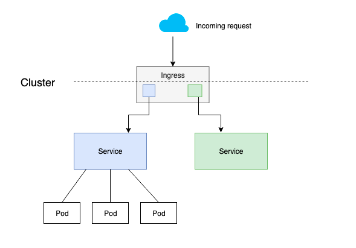
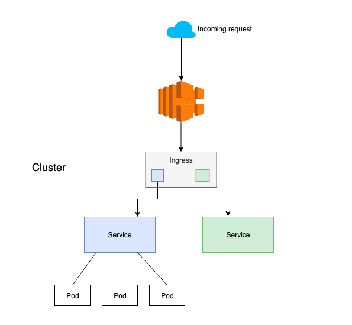

# EKS Cluster

[Components](#components)

## Usage

1. Copy file [fixtures.tfvars](terraform/modules/eks_cluster/examples/complete/fixtures.tfvars) file from `terraform/modules/eks_cluster/examples/complete/fixtures.tfvars` to [zimagi_clusters](terraform/zimagi_clusters/test.tfvars) folder
2. Rename and fill out fixtures.tfvars
3. Add file, commit your changes and push into repo
4. Run action

## Components
- VPC
  - Network with address range 172.16.0.0/16
- Subnetworks
  - Nat gateway
  - availability_zones
- EKS Cluster
  - Control plane
  - IAM Role to allow the cluster to access other AWS services
  - Security Group which is used by EKS workers to connect to the cluster and kubelets and pods to receive communication from the cluster control plane
  - The module creates and automatically applies an authentication ConfigMap to allow the workers nodes to join the cluster and to add additional users/roles/accounts

## EKS Cluster

## Authentication

Every Terraform module that provisions an EKS cluster has faced the challenge that access to the cluster is partly controlled by a resource inside the cluster,
a ConfigMap called aws-auth. You need to be able to access the cluster through the Kubernetes API to modify the ConfigMap, because there is no AWS API for it.
This presents a problem: how do you authenticate to an API endpoint that you have not yet created?

- **kubeconfig**: After creating the EKS cluster, terraform put `kubeconfig` file. This file can be used as an artifact with circleci.
- **data source** (default method): An authentication token can be retrieved using the `aws_eks_cluster_auth` data source. Again, this works, as long as the token does not expire while
Terraform is running, and the token is refreshed during the "plan" phase before trying to refresh the state. Unfortunately, failures of both types have been seen.
- **exec**: An authentication token can be retrieved on demand by using the `exec` feature of the Kubernetes provider to call `aws eks get-token`. This requires
 that the aws CLI be installed and available to Terraform and that it has access to sufficient credentials to perform the authentication and is configured to use them.

> Currently, the exec option appears to be the most reliable method, so I recommend using it if possible, but because of the extra requirements it has, data source is the default authentication method.

## Network Load Balancer with the NGINX Ingress Controller

[Kubernetes Ingress](https://kubernetes.io/docs/concepts/services-networking/ingress/) is an API object that provides a collection of routing rules that govern how external/internal users access [Kubernetes services](https://kubernetes.io/docs/concepts/services-networking/service/) running in a cluster. An [ingress controller](https://kubernetes.io/docs/concepts/services-networking/ingress-controllers/) is responsible for reading the ingress resource information and processing it appropriately.

### What is a Network Load Balancer?

An [AWS Network Load Balancer](https://docs.aws.amazon.com/elasticloadbalancing/latest/network/introduction.html) functions at the fourth layer of the Open Systems Interconnection (OSI) model. It can handle millions of requests per second. After the load balancer receives a connection request, it selects a target from the target group for the default rule. It attempts to open a TCP connection to the selected target on the port specified in the listener configuration.

### Exposing Zimagi on EKS

Using Ingress to expose your service is [one way](https://kubernetes.io/docs/concepts/services-networking/service/#publishing-services-service-types) of doing it. Ingress is not a service type, but it acts as the entry point for your cluster. It lets you consolidate your routing rules into a single resource, as it can expose multiple services under the same IP address.

### Ingress in Kubernetes

Kubernetes supports a high-level abstraction called Ingress, which allows simple host- or URL-based HTTP routing. An Ingress is a core concept (in beta) of Kubernetes. It is always implemented by a third party proxy; these implementations are known as ingress controllers. An ingress controller is responsible for reading the ingress resource information and processing that data accordingly. Different ingress controllers have extended the specification in different ways to support additional use cases.

Typically, your Kubernetes services will impose additional requirements on your ingress. Examples of this include:

- Content-based routing: e.g.,  routing based on HTTP method, request headers, or other properties of the  specific request.
- Resilience: e.g., rate  limiting, timeouts.
- Support for multiple  protocols: e.g., WebSockets or gRPC.
- Authentication.

An ingress controller is a DaemonSet or Deployment, deployed as a Kubernetes Pod, that watches the endpoint of the API server for updates to the Ingress resource. Its job is to satisfy requests for Ingresses. NGINX ingress is one such implementation.

### Put Load Balancer front of an Ingress

Ingress is tightly integrated into Kubernetes, meaning that your existing workflows around `kubectl` will likely extend nicely to managing ingress. An Ingress controller does not typically eliminate the need for an external load balancer , it simply adds an additional layer of routing and control behind the load balancer.

Pods and nodes are not guaranteed to live for the whole lifetime that the user intends: pods are ephemeral and vulnerable to kill signals from Kubernetes during occasions such as:

- Scaling
- Memory or CPU saturation.
- Rescheduling for more efficient resource use.
- Downtime due to outside factors.

The load balancer (Kubernetes service) is a construct that stands as a single, fixed-service endpoint for a given set of pods or worker nodes. To take advantage of the previously-discussed benefits of a Network Load Balancer (NLB), we create a Kubernetes service of  type:loadbalancer with the NLB annotations, and this load balancer sits in front of the ingress controller – which is itself a pod or a set of pods. In AWS, for a set of EC2 compute instances managed by an Autoscaling Group, there should be a load balancer that acts as both a fixed referable address and a load balancing mechanism.

### Ingress with load balancer

The diagram above shows a Network Load Balancer in front of the Ingress resource. This load balancer will route traffic to a Kubernetes service (or Ingress) on your cluster that will perform service-specific routing. NLB with the Ingress definition provides the benefits of both a NLB and an Ingress resource.

### Advantages of Nginx Load Balancer

A Network Load Balancer is capable of handling millions of requests per second while maintaining ultra-low latencies, making it ideal for load balancing TCP traffic. NLB is optimized to handle sudden and volatile traffic patterns while using a single static IP address per Availability Zone. The benefits of using a NLB are:

- Static IP/elastic IP addresses: For each Availability Zone (AZ) you enable on the NLB, you have a network interface. Each load balancer node in the AZ uses this network interface to get a static IP address. You can also use Elastic IP to assign a fixed IP address for each Availability Zone.
- Scalability: Ability to handle volatile workloads and scale to millions of requests per second.
- Zonal isolation: The Network Load Balancer can be used for application architectures within a Single Zone. Network Load Balancers attempt to route a series of requests from a particular source to targets in a single AZ while still providing automatic failover should those targets become unavailable.
- Source/remote address preservation: With a Network Load Balancer, the original source IP address and source ports for the incoming connections remain unmodified. With Classic and Application load balancers, we had to use HTTP header X-Forwarded-For to get the remote IP address.
- Long-lived TCP connections: Network Load Balancer supports long-running TCP connections that can be open for months or years, making it ideal for WebSocket-type applications, IoT, gaming, and messaging applications.
- Reduced bandwidth usage: Most applications are bandwidth-bound and should see a cost reduction (for load balancing) of about 25% compared to Application or Classic Load Balancers.
- SSL termination: SSL termination will need to happen at the backend, since SSL termination on NLB for Kubernetes is not yet available.

For any NLB usage, the backend security groups control the access to the application (NLB does not have security groups of it own). The worker node security group handles the security for inbound/ outbound traffic.